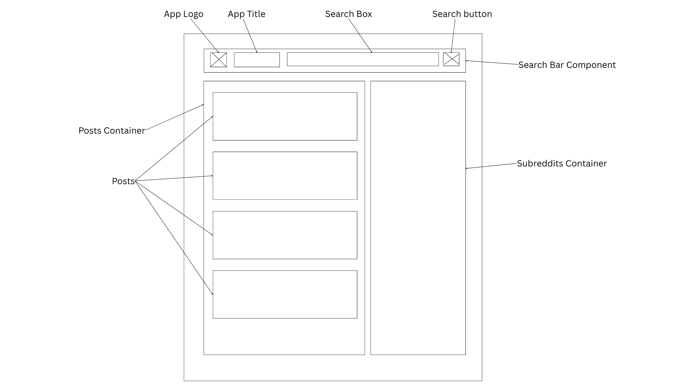

# Reddit Minimal

## Description
Reddit Minimal is an academic practice project intended to simulate the
development of a real-world application—from initial design through testing and
optimizations to deployment.

The application is a simple Reddit clone designed to use the Reddit .json API
 to retrieve and display popular posts and popular subreddits.

The application allows filtering of posts by a search term and subreddit.

### Wireframe
This is a single-page application with the following initial wireframe:

### Technologies
- HTML,CSS,JS
- Vite
- React
- Redux
- React-Redux
- Framer Motion
- Reddit API
- Vitest, Cypress

### Features
- Posts Filter
- Load Posts by Subreddit
- Responsive Design
- Accessibility
- Unit Testing
- End-to-End Testing
- Lighthouse Optimizations